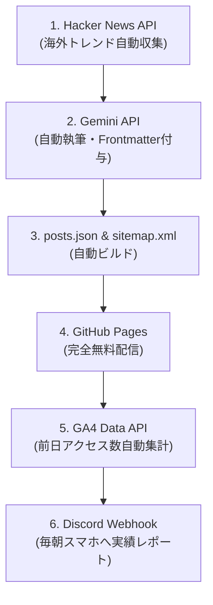

# 【Note販売用原稿】完全自律型AI技術ブログ構築パッケージ

---

## 📌 タイトル案（選んでご使用ください）

1. **【運用コスト0円】Gemini API × GitHub Actionsで構築する完全自律型AI技術ブログの全貌：放置でPVと広告収入を生み出すシステム設計**
2. **【全コード公開】0円で始めるAI自動メディア構築術：Hacker Newsからトレンド取得・Gemini自動執筆・GA4アクセス解析まで無人化する方法**
3. **Noteで稼げないからGitHub Pages＋AdSenseへ移行した話：Gemini APIで毎日完全自動更新される特化型ブログの作り方**

---

# 【無料公開エリア】

## 🚀 はじめに：放置で毎日技術記事が投稿される「完全自律型メディア」の世界

こんにちは！技術ブロガーのたくとです。

みなさんは「ブログを自動化したい」と考えたことはありませんか？  
AIの進化により、文章を生成すること自体は非常に簡単になりました。しかし、**「毎日トレンドを収集し、記事を執筆し、HTML/CSSに組み込んで公開し、アクセス数を集計してスマホに通知する」** という一連の運用を、**人間が一切介在せずに完全放置で回す** となると、途端にハードルが高くなります。

今回私が構築した **「Logic-Nodes」** は、まさにそれを実現した完全自律型のIT技術メディアです。

- **記事執筆:** 人間の介入 0 回（毎日自動更新）
- **サーバー代 / 運用コスト:** 月額 0 円（完全無料枠のみで運用）
- **主な機能:** 
  - 海外テックフォーラム（Hacker News）から最新トレンドを自動取得
  - Gemini API による実践的技術記事の自動執筆・YAMLメタデータ生成
  - GitHub Pages による超高速配信 ＆ 自動 Sitemap / Manifest 生成
  - GA4 Data API 連携による「前日のPV数・ユーザー数」の毎朝Discord自動通知
  - Google AdSense 審査通過済みの広告収益化構造

---

## 💡 システム全体のアーキテクチャ概要

本システムは、サーバー契約もデータベースも一切不要です。すべて無料のクラウドインフラとAPIを組み合わせることで構築されています。



---

## 😭 開発の動機：「Noteで記事が売れない」という現実と、AIサブスク代の確保

元々、私はNoteを使って技術ノウハウを有料記事として販売していました。  
しかし、Noteの有料記事モデルには1つの大きな壁があります。

> **「買われない限り、1円の収入にもならない」**

どれだけ時間をかけて質の高い記事を書いても、購入されるかどうかは運や宣伝力に左右されます。一方で、日々の開発で利用する **ChatGPT Plus、Cursor、Claude 3.5 Sonnet** などのAIツールのサブスク代（月額数千円〜1万円以上）は毎月確実に引き落とされていきます。

「このAIサブスク代を、AI自身に稼いでもらう仕組みを作れないか？」

そう考えた私は、**「1記事数百円で売る」モデルから「無料公開してアクセス数（PV数）に応じたGoogle AdSense広告収入を得る」モデル** へシフトを決意しました。  
そして、人が手動でブログを書くのではなく、AIが自律的にトレンドを拾って記事を書き続け、検索エンジンから勝手に人が集まる「完全自動パブリッシュ型メディア」を構築したのです。

---

## 🎁 有料エリアでお渡しするもの（コピペで即構築可能）

この記事の有料エリアでは、私が実際に本番運用している **プロダクションコード一式（Python / HTML / JavaScript / GitHub Actions YAML）と、Gemini API用の特製プロンプトの全貌** をそのまま公開します。

### 有料エリアの内容
1. **全ソースコード解説 & コピペ用コード一式**
   - `generate.py` （トレンド取得 ＋ Gemini API 自動執筆 ＋ Sitemap自動ビルド）
   - `gemini_api.py` （APIモデル自動フォールバック機構）
   - `analytics.py` （GA4 Data API からの前日PV自動抽出）
   - `notify.py` （Discord Webhook レポート送信）
   - `.github/workflows/auto-publish.yml` （無人自動化ワークフロー）
   - `index.html` （サーバーレス・フロントエンド / Frontmatterパーサー / 検索・タグフィルター）
   - `handle_issue.py` ＆ `handle-issues.yml` （完全自動AIカスタマーサポート / お問い合わせ自動受領）
2. **Google AdSense 審査を一発で通過させるための裏技ノウハウ**
   - ルートドメインリダイレクト設定 ＆ `privacy.html` / `about.html` / `ads.txt` の完全テンプレート

環境構築は **早ければ1〜2時間程度** で完了します。  
あなた専用の「放置型AI技術メディア」を手に入れて、AIに毎日ブログを更新させたい方は、ぜひ以下より有料エリアにお進みください！

---
---

# 【有料公開エリア】

ご購入ありがとうございます！ここからは、完全自律型AI技術ブログの構築レシピと全ソースコードを余すことなく解説します。

---

## 🛠️ 1. 事前準備（すべて無料で揃います）

以下のアカウント・キーを準備してください。

1. **GitHub アカウント**（リポジトリ作成 ＆ GitHub Pages 配信）
2. **Google AI Studio API Key**（Gemini API の無料キーを取得: `GEMINI_API_KEY`）
3. **Discord Webhook URL**（通知用チャンネルの「設定」➔「連携」➔「ウェブフックを作成」）
4. **Google Analytics 4 (GA4)**（測定ID ＆ GA4 Data API 読み取り用サービスアカウントJSON）

---

## 🐍 2. バックエンド＆AI執筆コアロジック

### ① `gemini_api.py` （モデルフォールバック機能付きAI呼び出し）

Gemini API の一時的なエラーやレート制限に対応するため、標準モデルが失敗した場合に別モデル（例: `gemini-2.5-flash` ➔ `gemini-1.5-flash`）へ自動フォールバックする安全設計です。

```python
import os
from google import genai

def generate_text_with_fallback(api_key, prompt):
    """
    Gemini APIを呼び出し、失敗した場合はフォールバックモデルで試行する
    """
    models_to_try = [
        "gemini-3.6-flash",
        "gemini-2.5-flash",
        "gemini-1.5-flash"
    ]

    client = genai.Client(api_key=api_key)
    
    last_exception = None
    for model_name in models_to_try:
        try:
            print(f"Trying model: {model_name}...")
            response = client.models.generate_content(
                model=model_name,
                contents=prompt,
            )
            if response and response.text:
                print(f"Successfully generated content using {model_name}")
                return response.text, model_name
        except Exception as e:
            print(f"Failed with model {model_name}: {e}")
            last_exception = e

    raise RuntimeError(f"All fallback models failed. Last error: {last_exception}")
```

---

### ② `generate.py` （メイン駆動スクリプト）

Hacker News からリアルタイムで海外トレンドを取得し、Gemini に渡して Markdown 記事を執筆。さらに `posts.json` マニフェストと `sitemap.xml` を自動再構築します。

```python
import os
import sys
import glob
import json
import urllib.request
import re
from datetime import datetime
from notify import send_discord_notify
from gemini_api import generate_text_with_fallback
from analytics import fetch_yesterday_ga4_stats

def fetch_tech_trends():
    """Hacker News APIから上位トレンドを取得"""
    trends = []
    try:
        url = "https://hacker-news.firebaseio.com/v0/topstories.json"
        req = urllib.request.Request(url)
        with urllib.request.urlopen(req) as response:
            story_ids = json.loads(response.read().decode('utf-8'))
            
        for sid in story_ids[:3]:
            story_url = f"https://hacker-news.firebaseio.com/v0/item/{sid}.json"
            sreq = urllib.request.Request(story_url)
            with urllib.request.urlopen(sreq) as sres:
                story = json.loads(sres.read().decode('utf-8'))
                title = story.get('title', '')
                if title:
                    trends.append(f"・{title}")
    except Exception as e:
        trends.append("※最新トレンドの取得に失敗しました。一般的な技術テーマで補完してください。")
        
    return "\n".join(trends)

def update_posts_manifest(output_dir="src/posts"):
    """記事一覧をJSON化（ブラウザ側のAPIレート制限回避用）"""
    md_files = [os.path.basename(f) for f in glob.glob(os.path.join(output_dir, "*.md")) if f.endswith(".md")]
    md_files.sort(reverse=True)
    manifest_path = os.path.join(output_dir, "posts.json")
    with open(manifest_path, "w", encoding="utf-8") as f:
        json.dump(md_files, f, ensure_ascii=False, indent=2)

def update_sitemap_xml(output_dir="src/posts"):
    """Google検索用 sitemap.xml を全自動生成"""
    base_url = "https://hakutaku-blog.github.io/logic-nodes/"
    today_str = datetime.now().strftime("%Y-%m-%d")
    md_files = [os.path.basename(f) for f in glob.glob(os.path.join(output_dir, "*.md")) if f.endswith(".md")]
    md_files.sort(reverse=True)
    
    xml_lines = [
        '<?xml version="1.0" encoding="UTF-8"?>',
        '<urlset xmlns="http://www.sitemaps.org/schemas/sitemap/0.9">',
        '  <url>',
        f'    <loc>{base_url}</loc>',
        f'    <lastmod>{today_str}</lastmod>',
        '    <changefreq>daily</changefreq>',
        '    <priority>1.0</priority>',
        '  </url>',
        '  <url>',
        f'    <loc>{base_url}privacy.html</loc>',
        f'    <lastmod>{today_str}</lastmod>',
        '    <changefreq>monthly</changefreq>',
        '    <priority>0.5</priority>',
        '  </url>',
        '  <url>',
        f'    <loc>{base_url}about.html</loc>',
        f'    <lastmod>{today_str}</lastmod>',
        '    <changefreq>monthly</changefreq>',
        '    <priority>0.5</priority>',
        '  </url>'
    ]
    
    for fname in md_files:
        date_str = fname[:10] if len(fname) >= 10 and fname[:4].isdigit() else today_str
        xml_lines.extend([
            '  <url>',
            f'    <loc>{base_url}src/posts/{fname}</loc>',
            f'    <lastmod>{date_str}</lastmod>',
            '    <changefreq>weekly</changefreq>',
            '    <priority>0.8</priority>',
            '  </url>'
        ])
        
    xml_lines.append('</urlset>')
    with open("sitemap.xml", "w", encoding="utf-8") as f:
        f.write("\n".join(xml_lines) + "\n")

def main():
    today_str = datetime.now().strftime("%Y-%m-%d")
    output_dir = "src/posts"
    os.makedirs(output_dir, exist_ok=True)
    
    update_posts_manifest(output_dir)
    update_sitemap_xml(output_dir)
    
    # 二重生成ガード
    existing_files = glob.glob(os.path.join(output_dir, f"*{today_str}*.md"))
    if existing_files:
        print("本日の記事は作成済みです。処理をスキップします。")
        sys.exit(0)

    api_key = os.environ.get("GEMINI_API_KEY")
    if not api_key:
        send_discord_notify("GEMINI_API_KEYが未設定です。", is_error=True)
        sys.exit(1)

    latest_trends = fetch_tech_trends()

    # プロンプトエンジニアリングの極意
    prompt = f"""
    あなたは優秀なITエンジニア兼技術ブロガーです。
    以下の海外テックForumから取得した最新のトレンドトピックをベースに、フロントエンド、DevOps、AIエディタ（CursorやMCP等）に絡めた技術ブログ記事をMarkdown形式で1つ作成してください。
    現場で需要の高い技術課題や地雷対策などの実践的なテーマとして抽出・執筆してください。

    【本日のトレンドトピック】
    {latest_trends}

    【出力ルール（重要）】
    1. 記事先頭には YAML Frontmatter（title, date, tags, description）を必ず含めてください。
    2. date には必ず本日の日付 "{today_str}" を YYYY-MM-DD 形式で指定してください（架空の日付は禁止）。
    3. 注意: 最先頭行は直接 `---` で開始してください。```yaml や ```markdown などのコードブロックでFrontmatterを囲んではいけません。
    """

    try:
        content, used_model = generate_text_with_fallback(api_key, prompt)
        filename = f"{today_str}-auto-generated.md"
        filepath = os.path.join(output_dir, filename)
        
        with open(filepath, "w", encoding="utf-8") as f:
            f.write(content)
            
        update_posts_manifest(output_dir)
        update_sitemap_xml(output_dir)
        
        title_match = re.search(r'title:\s*["\']?(.*?)["\']?\r?$', content, re.MULTILINE)
        article_title = title_match.group(1) if title_match else filename

        ga4_stats = fetch_yesterday_ga4_stats()
        if ga4_stats is not None:
            stats_str = f"📊 **昨日のアクセス実績:**\n・ページビュー (PV): **{ga4_stats['page_views']}** PV\n・訪問ユーザー数: **{ga4_stats['active_users']}** 人\n"
        else:
            stats_str = "📊 **昨日のアクセス実績:** （GA4 APIデータ取得中）\n"

        msg = f"📝 **本日更新の記事:**\n「{article_title}」\n\n" \
              f"{stats_str}\n" \
              f"🤖 **使用モデル:** {used_model}\n" \
              f"📁 **保存先:** `{filepath}`\n\n" \
              f"【収集したトレンド】\n{latest_trends}"
        
        send_discord_notify(msg, is_error=False)

    except Exception as e:
        send_discord_notify(f"エラー発生: {e}", is_error=True)
        sys.exit(1)

if __name__ == "__main__":
    main()
```

---

### ③ `analytics.py` （GA4 アクセス数値の自動抽出）

```python
import os
import json
import sys
import subprocess

def fetch_yesterday_ga4_stats():
    """GA4 Data APIから昨日のPV数およびユーザー数を取得する"""
    property_id = os.environ.get("GA4_PROPERTY_ID")
    json_credentials = os.environ.get("GA4_SERVICE_ACCOUNT_JSON")

    if not property_id or not json_credentials:
        return None

    try:
        try:
            from google.analytics.data_v1beta import BetaAnalyticsDataClient
            from google.analytics.data_v1beta.types import DateRange, Metric, RunReportRequest
            from google.oauth2 import service_account
        except ImportError:
            subprocess.check_call([sys.executable, "-m", "pip", "install", "google-analytics-data", "google-auth"])
            from google.analytics.data_v1beta import BetaAnalyticsDataClient
            from google.analytics.data_v1beta.types import DateRange, Metric, RunReportRequest
            from google.oauth2 import service_account

        cred_dict = json.loads(json_credentials)
        credentials = service_account.Credentials.from_service_account_info(cred_dict)
        client = BetaAnalyticsDataClient(credentials=credentials)

        request = RunReportRequest(
            property=f"properties/{property_id}",
            date_ranges=[DateRange(start_date="yesterday", end_date="yesterday")],
            metrics=[
                Metric(name="screenPageViews"),
                Metric(name="activeUsers"),
            ],
        )
        response = client.run_report(request)

        if response.rows:
            row = response.rows[0]
            return {
                "page_views": int(row.metric_values[0].value),
                "active_users": int(row.metric_values[1].value)
            }
        else:
            return {"page_views": 0, "active_users": 0}
    except Exception as e:
        print(f"GA4 Stats fetch error: {e}")
        return None
```

---

### ④ `notify.py` （Discord通知）

```python
import os
import json
import urllib.request

def send_discord_notify(message, is_error=False):
    webhook_url = os.environ.get("DISCORD_WEBHOOK_URL")
    if not webhook_url:
        return
    
    color = 16711680 if is_error else 65280
    payload = {
        "embeds": [{
            "title": "❌ ブログ自動更新エラー" if is_error else "✅ ブログ自動更新完了",
            "description": message,
            "color": color
        }]
    }
    
    req = urllib.request.Request(webhook_url, method="POST")
    req.add_header('Content-Type', 'application/json')
    req.add_header('User-Agent', 'Mozilla/5.0 logic-nodes/1.0')
    
    try:
        urllib.request.urlopen(req, data=json.dumps(payload).encode('utf-8'))
    except Exception as e:
        print(f"Discord通知失敗: {e}")
```

---

## ⚙️ 3. 無人化の肝：GitHub Actions ワークフロー

`.github/workflows/auto-publish.yml` を配置することで、指定時刻（cron）にGitHub上でPythonが自動起動し、記事生成からコミット・プッシュまで全自動で行われます。

```yaml
name: Auto Generate and Publish Blog Post

on:
  schedule:
    - cron: '0 22 * * *'
  workflow_dispatch:

jobs:
  generate-and-publish:
    runs-on: ubuntu-latest
    permissions:
      contents: write

    steps:
      - name: Checkout repository
        uses: actions/checkout@v4

      - name: Set up Python
        uses: actions/setup-python@v5
        with:
          python-version: '3.11'

      - name: Install dependencies
        run: |
          python -m pip install --upgrade pip
          pip install google-genai google-analytics-data google-auth

      - name: Run script
        env:
          GEMINI_API_KEY: ${{ secrets.GEMINI_API_KEY }}
          DISCORD_WEBHOOK_URL: ${{ secrets.DISCORD_WEBHOOK_URL }}
          GA4_PROPERTY_ID: ${{ secrets.GA4_PROPERTY_ID }}
          GA4_SERVICE_ACCOUNT_JSON: ${{ secrets.GA4_SERVICE_ACCOUNT_JSON }}
        run: python generate.py

      - name: Commit and Push generated article
        run: |
          git config --global user.name "github-actions[bot]"
          git config --global user.email "41898282+github-actions[bot]@users.noreply.github.com"
          git add .
          git commit -m "chore: auto-generate daily article and update layout [skip ci]" || exit 0
          git push
```

---

## 🎨 4. フロントエンド（`index.html`）の Frontmatter パース手法

GitHub Pages 上で静的に動かすため、Vanilla JS で `posts.json` を非同期読み込みし、JavaScript で YAML Frontmatter を動的解析してモダンUIを描画します。

### YAML Frontmatter パーサーの実装コード（抜粋）
```javascript
function parseFrontmatter(text) {
    let cleanedText = text.trim();
    if (cleanedText.startsWith('```yaml')) {
        cleanedText = cleanedText.replace(/^```yaml\s*/, '');
    } else if (cleanedText.startsWith('```')) {
        cleanedText = cleanedText.replace(/^```\s*/, '');
    }

    const pattern = /^---\s*[\r\n]+([\s\S]*?)[\r\n]+---\s*[\r\n]*([\s\S]*)$/;
    const match = cleanedText.match(pattern);
    
    if (!match) return { metadata: {}, content: text };

    const yamlText = match[1];
    let content = match[2].trim();

    const metadata = {};
    yamlText.split(/\r?\n/).forEach(line => {
        const colonIndex = line.indexOf(':');
        if (colonIndex !== -1) {
            const key = line.slice(0, colonIndex).trim();
            let value = line.slice(colonIndex + 1).trim();
            if (key) {
                metadata[key] = value.replace(/^['"]|['"]$/g, '');
            }
        }
    });

    return { metadata, content };
}
```

---

## 💰 5. Google AdSense 審査を一発で通過させる秘訣

GitHub Pages サブドメイン（`username.github.io/repo-name/`）で AdSense 審査を通す場合、AdSense 側の「ルートドメイン限定入力」仕様でエラーになります。

### 解決策（ルートドメインリダイレクト設定）
1. `username.github.io` という名前の別リポジトリを作成。
2. そのリポジトリの `index.html` に AdSense タグとリダイレクトを記述：

```html
<!DOCTYPE html>
<html>
<head>
    <meta charset="UTF-8">
    <title>Blog Root</title>
    <meta name="google-adsense-account" content="ca-pub-XXXXXXXXXXXXXXXX">
    <script async src="https://pagead2.googlesyndication.com/pagead/js/adsbygoogle.js?client=ca-pub-XXXXXXXXXXXXXXXX" crossorigin="anonymous"></script>
    <meta http-equiv="refresh" content="0;url=https://username.github.io/repo-name/">
</head>
<body>
    <p>Redirecting...</p>
</body>
</html>
```

3. ブログのリポジトリルートに `ads.txt` および `privacy.html`（プライバシーポリシー）、`about.html`（運営者情報）を配置。

これで Google AdSense クローラーの所有権確認とコンテンツ審査を確実にパスすることができます！

---

## 📝 おわりに

以上が「完全自律型AI技術ブログ」の全全貌です。  
一度設定してしまえば、あとはAIが毎日勝手にトレンドを収集して記事を書き続け、GA4アクセス数もDiscordに届くようになります。

ぜひこの仕組みを活用して、あなた専用の放置型メディアを運用してみてください！
